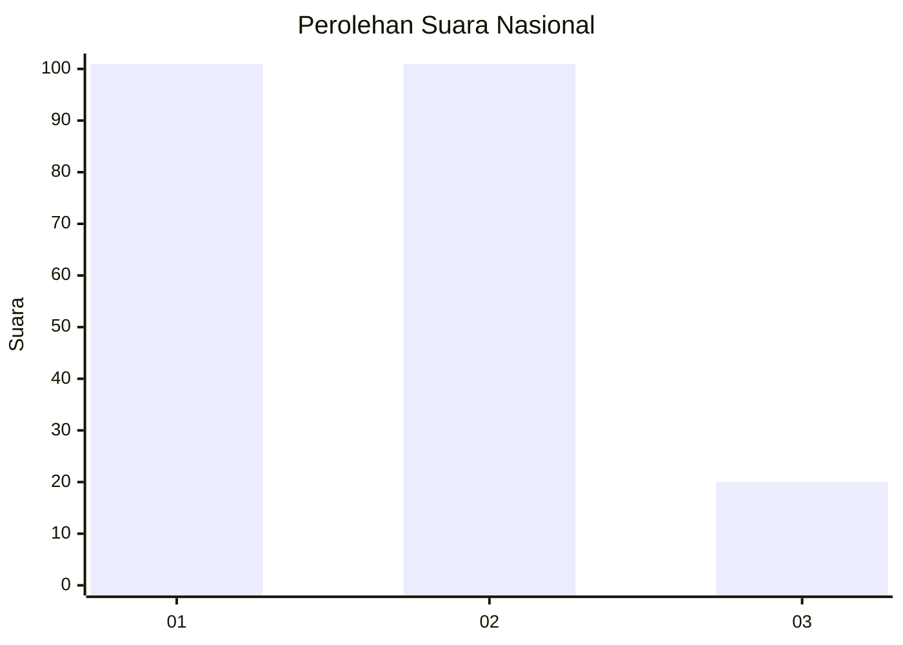
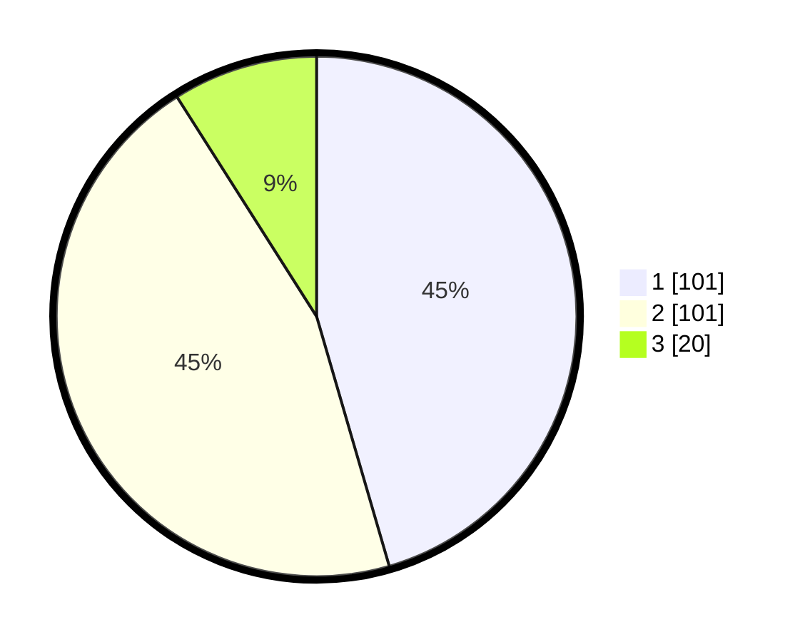

# Hasil

## Grafik

## Tabel

| No.    | Nama Paslon    | Suara | Suara (raw) | Persentase |
|:------ |:-------------- | -----:| -----------:| ----------:|
| 100025 | ANIES MUHAIMIN | 101   | [101][p-1]  | 45,50      |
| 100026 | PRABOWO GIBRAN | 101   | [101][p-2]  | 45,50      |
| 100027 | GANJAR MAHFUD  | 20    | [20][p-3]   | 9,01       |

[p-1]: https://github.com/gigit-pemilu/pemilu-2024/blob/main/pilpres/hitung-suara/sub/31-dki-jakarta/sub/75-jakarta-timur/sub/10-cipayung/sub/1007-lubang-buaya/sub/197-tps/sub/paslon-1.txt
[p-2]: https://github.com/gigit-pemilu/pemilu-2024/blob/main/pilpres/hitung-suara/sub/31-dki-jakarta/sub/75-jakarta-timur/sub/10-cipayung/sub/1007-lubang-buaya/sub/197-tps/sub/paslon-2.txt
[p-3]: https://github.com/gigit-pemilu/pemilu-2024/blob/main/pilpres/hitung-suara/sub/31-dki-jakarta/sub/75-jakarta-timur/sub/10-cipayung/sub/1007-lubang-buaya/sub/197-tps/sub/paslon-3.txt

## Foto C Plano

https://sirekap-obj-formc.kpu.go.id/15a7/pemilu/ppwp/31/75/10/10/07/3175101007197-20240214-155044--d904a1cb-0c33-40fc-b48b-78d3980fb384.jpg

https://sirekap-obj-formc.kpu.go.id/15a7/pemilu/ppwp/31/75/10/10/07/3175101007197-20240214-155247--bd73e470-0f8e-4752-8a07-0551f89b1a18.jpg

https://sirekap-obj-formc.kpu.go.id/15a7/pemilu/ppwp/31/75/10/10/07/3175101007197-20240214-155814--7b10b861-f38a-43dc-beb6-753215f8b938.jpg

## Metadata

| Key        | Value               |
| ---------- | ------------------- |
| Time Stamp | 2024-02-15 15:00:29 |

