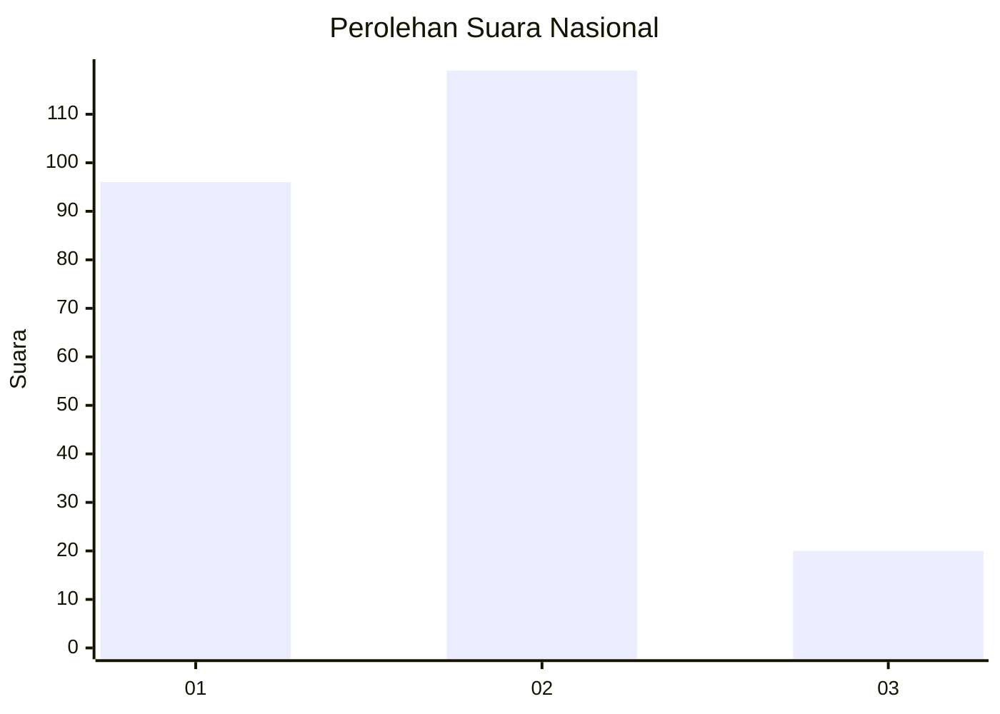
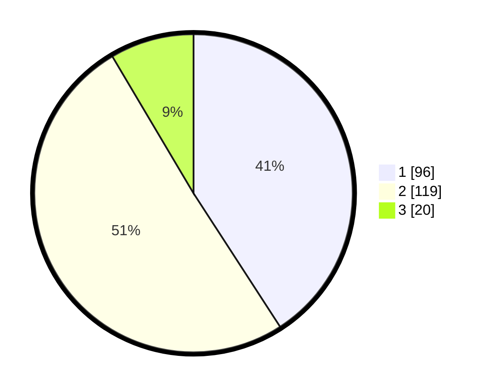

# Hasil

## Grafik

## Tabel

| No.    | Nama Paslon    | Suara | Suara (raw) | Persentase |
|:------ |:-------------- | -----:| -----------:| ----------:|
| 100025 | ANIES MUHAIMIN | 96    | [96][p-1]   | 40,85      |
| 100026 | PRABOWO GIBRAN | 119   | [119][p-2]  | 50,64      |
| 100027 | GANJAR MAHFUD  | 20    | [20][p-3]   | 8,51       |

[p-1]: https://github.com/gigit-pemilu/pemilu-2024/blob/main/pilpres/hitung-suara/sub/31-dki-jakarta/sub/75-jakarta-timur/sub/10-cipayung/sub/1008-ceger/sub/002-tps/sub/paslon-1.txt
[p-2]: https://github.com/gigit-pemilu/pemilu-2024/blob/main/pilpres/hitung-suara/sub/31-dki-jakarta/sub/75-jakarta-timur/sub/10-cipayung/sub/1008-ceger/sub/002-tps/sub/paslon-2.txt
[p-3]: https://github.com/gigit-pemilu/pemilu-2024/blob/main/pilpres/hitung-suara/sub/31-dki-jakarta/sub/75-jakarta-timur/sub/10-cipayung/sub/1008-ceger/sub/002-tps/sub/paslon-3.txt

## Foto C Plano

https://sirekap-obj-formc.kpu.go.id/2bc6/pemilu/ppwp/31/75/10/10/08/3175101008002-20240214-195028--3d3600fe-2312-4b1a-af1f-3a494076ad88.jpg

https://sirekap-obj-formc.kpu.go.id/2bc6/pemilu/ppwp/31/75/10/10/08/3175101008002-20240214-195134--85702f25-221e-4765-89b0-035dc92c7e4e.jpg

https://sirekap-obj-formc.kpu.go.id/2bc6/pemilu/ppwp/31/75/10/10/08/3175101008002-20240214-195225--fd708951-fce5-4e0f-a9b5-b459f043bcbf.jpg

## Metadata

| Key        | Value               |
| ---------- | ------------------- |
| Time Stamp | 2024-02-15 12:00:28 |

