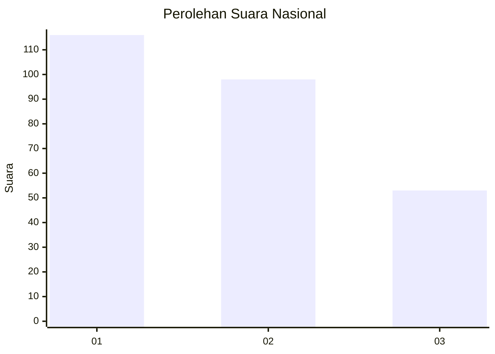
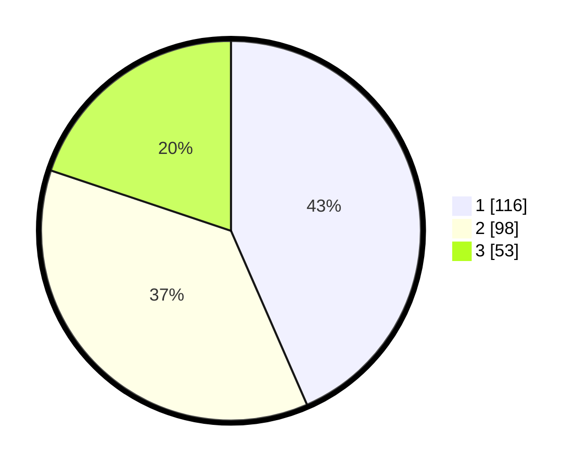

# Hasil

## Grafik

## Tabel

| No. | Nama Paslon    | Suara | Suara (raw) | Persentase |
|:--- |:-------------- | -----:| -----------:| ----------:|
| 1   | ANIES MUHAIMIN | 116   | [116][p-1]  | 43,45      |
| 2   | PRABOWO GIBRAN | 98    | [98][p-2]   | 36,70      |
| 3   | GANJAR MAHFUD  | 53    | [53][p-3]   | 19,85      |

[p-1]: https://github.com/gigit-pemilu/pemilu-2024/blob/main/pilpres/hitung-suara/sub/31-dki-jakarta/sub/75-jakarta-timur/sub/10-cipayung/sub/1008-ceger/sub/004-tps/sub/paslon-1.txt
[p-2]: https://github.com/gigit-pemilu/pemilu-2024/blob/main/pilpres/hitung-suara/sub/31-dki-jakarta/sub/75-jakarta-timur/sub/10-cipayung/sub/1008-ceger/sub/004-tps/sub/paslon-2.txt
[p-3]: https://github.com/gigit-pemilu/pemilu-2024/blob/main/pilpres/hitung-suara/sub/31-dki-jakarta/sub/75-jakarta-timur/sub/10-cipayung/sub/1008-ceger/sub/004-tps/sub/paslon-3.txt

## Foto C Plano

https://sirekap-obj-formc.kpu.go.id/507c/pemilu/ppwp/31/75/10/10/08/3175101008004-20240214-225943--4517bd69-aeec-4046-8197-50b70d669016.jpg

https://sirekap-obj-formc.kpu.go.id/507c/pemilu/ppwp/31/75/10/10/08/3175101008004-20240214-230248--81d8e186-4f4f-481e-9cde-e2576bb7c272.jpg

https://sirekap-obj-formc.kpu.go.id/507c/pemilu/ppwp/31/75/10/10/08/3175101008004-20240214-230046--696e12d0-d786-49c5-b12d-4426c5a4401f.jpg

## Metadata

| Key        | Value               |
| ---------- | ------------------- |
| Time Stamp | 2024-02-15 16:00:26 |

