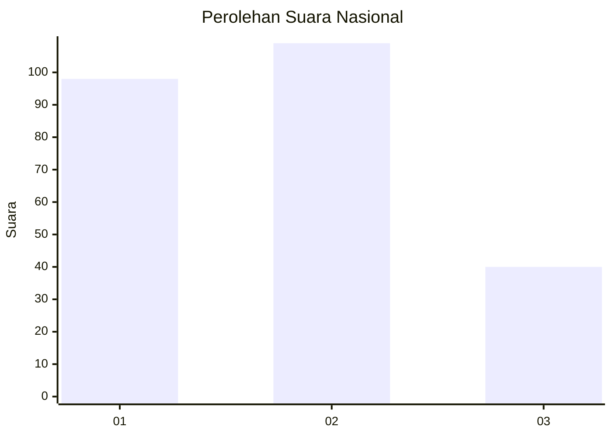
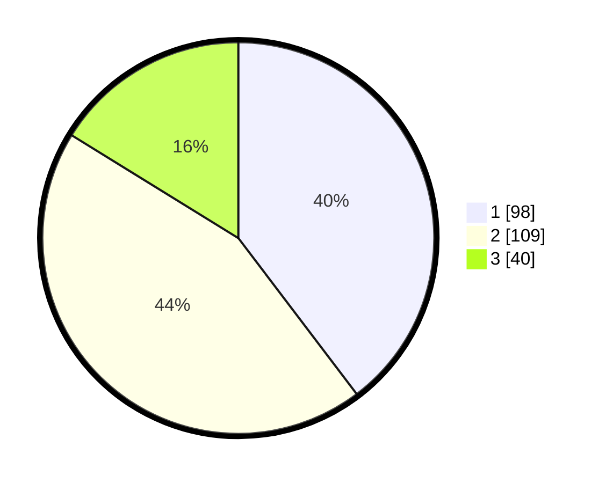

# Hasil

## Grafik

## Tabel

| No.    | Nama Paslon    | Suara | Suara (raw) | Persentase |
|:------ |:-------------- | -----:| -----------:| ----------:|
| 100025 | ANIES MUHAIMIN | 98    | [98][p-1]   | 39,68      |
| 100026 | PRABOWO GIBRAN | 109   | [109][p-2]  | 44,13      |
| 100027 | GANJAR MAHFUD  | 40    | [40][p-3]   | 16,19      |

[p-1]: https://github.com/gigit-pemilu/pemilu-2024/blob/main/pilpres/hitung-suara/sub/31-dki-jakarta/sub/75-jakarta-timur/sub/10-cipayung/sub/1008-ceger/sub/008-tps/sub/paslon-1.txt
[p-2]: https://github.com/gigit-pemilu/pemilu-2024/blob/main/pilpres/hitung-suara/sub/31-dki-jakarta/sub/75-jakarta-timur/sub/10-cipayung/sub/1008-ceger/sub/008-tps/sub/paslon-2.txt
[p-3]: https://github.com/gigit-pemilu/pemilu-2024/blob/main/pilpres/hitung-suara/sub/31-dki-jakarta/sub/75-jakarta-timur/sub/10-cipayung/sub/1008-ceger/sub/008-tps/sub/paslon-3.txt

## Foto C Plano

https://sirekap-obj-formc.kpu.go.id/9393/pemilu/ppwp/31/75/10/10/08/3175101008008-20240214-224203--b1078600-968c-4c4c-86da-eadcfc3e46de.jpg

https://sirekap-obj-formc.kpu.go.id/9393/pemilu/ppwp/31/75/10/10/08/3175101008008-20240214-230259--b49a2eb2-3d75-4756-a475-41bd01724c5e.jpg

https://sirekap-obj-formc.kpu.go.id/9393/pemilu/ppwp/31/75/10/10/08/3175101008008-20240214-230415--1945ee05-d78f-4929-bffb-1eb55fc7c079.jpg

## Metadata

| Key        | Value               |
| ---------- | ------------------- |
| Time Stamp | 2024-02-15 16:00:26 |

