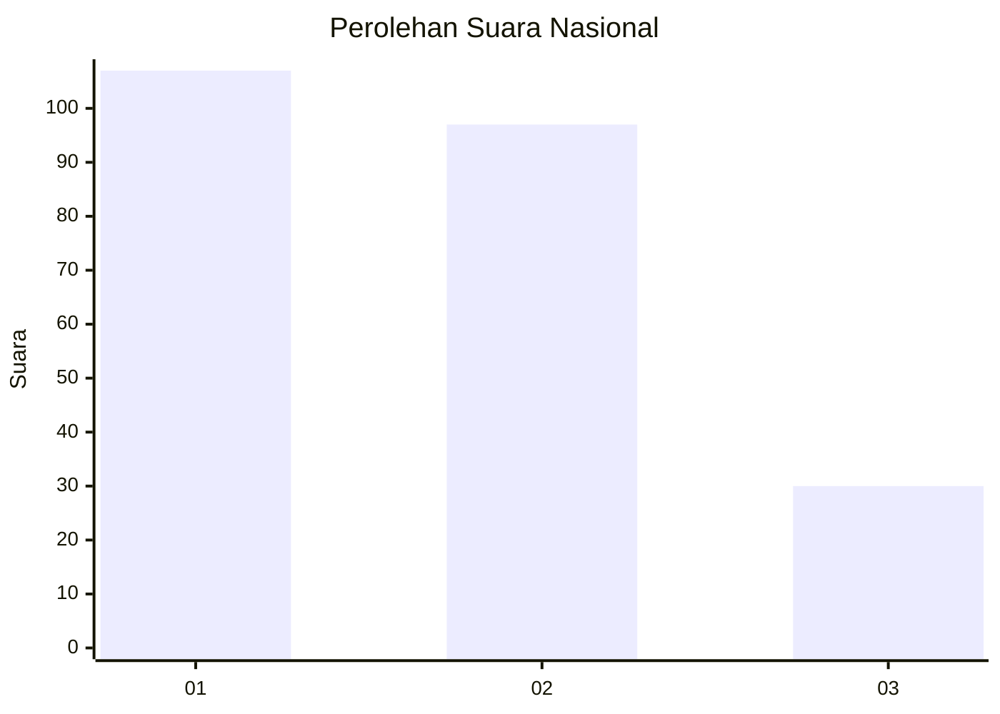
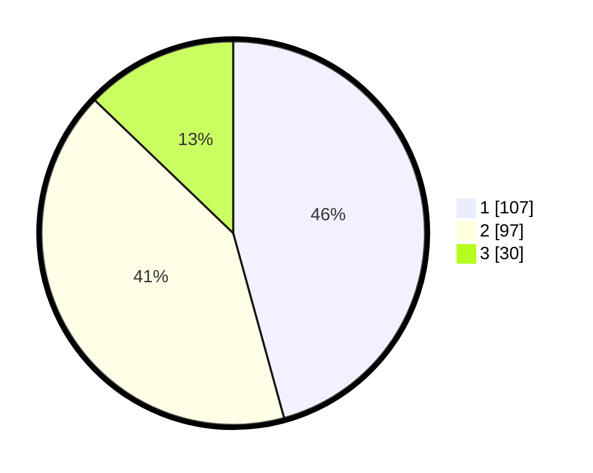

# Hasil

## Grafik

## Tabel

| No.    | Nama Paslon    | Suara | Suara (raw) | Persentase |
|:------ |:-------------- | -----:| -----------:| ----------:|
| 100025 | ANIES MUHAIMIN | 107   | [107][p-1]  | 45,73      |
| 100026 | PRABOWO GIBRAN | 97    | [97][p-2]   | 41,45      |
| 100027 | GANJAR MAHFUD  | 30    | [30][p-3]   | 12,82      |

[p-1]: https://github.com/gigit-pemilu/pemilu-2024/blob/main/pilpres/hitung-suara/sub/31-dki-jakarta/sub/75-jakarta-timur/sub/10-cipayung/sub/1008-ceger/sub/029-tps/sub/paslon-1.txt
[p-2]: https://github.com/gigit-pemilu/pemilu-2024/blob/main/pilpres/hitung-suara/sub/31-dki-jakarta/sub/75-jakarta-timur/sub/10-cipayung/sub/1008-ceger/sub/029-tps/sub/paslon-2.txt
[p-3]: https://github.com/gigit-pemilu/pemilu-2024/blob/main/pilpres/hitung-suara/sub/31-dki-jakarta/sub/75-jakarta-timur/sub/10-cipayung/sub/1008-ceger/sub/029-tps/sub/paslon-3.txt

## Foto C Plano

https://sirekap-obj-formc.kpu.go.id/4455/pemilu/ppwp/31/75/10/10/08/3175101008029-20240214-155758--e35401db-9035-4d9b-90be-564b7ed8bb80.jpg

https://sirekap-obj-formc.kpu.go.id/4455/pemilu/ppwp/31/75/10/10/08/3175101008029-20240214-155852--60a606e9-3557-4d84-8ba9-36523caa36c2.jpg

https://sirekap-obj-formc.kpu.go.id/4455/pemilu/ppwp/31/75/10/10/08/3175101008029-20240214-160145--95fcb81e-01ec-4436-910e-b63976b3424d.jpg

## Metadata

| Key        | Value               |
| ---------- | ------------------- |
| Time Stamp | 2024-02-25 12:00:00 |

